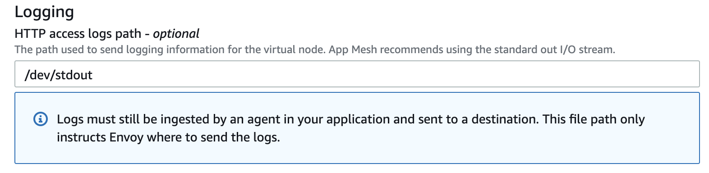

## FireLens Example: Parse Envoy Access Logs from AWS App Mesh

In this example, we will showcase how to parse the Envoy access logs for AWS App Mesh with FireLens. Some of the Fluent Bit concepts around custom configuration are covered in the [parse-common-log-formats](/examples/fluent-bit/parse-common-log-formats/README.md) example. This example builds on those concepts to showcase how to wire up a custom parser with FireLens and AWS App Mesh.

#### Sample application

In order to demonstrate a microservices application running in a service mesh, this example uses the [Color App](https://github.com/aws/aws-app-mesh-examples/tree/master/examples/apps/colorapp) as the example application. 

#### AWS App Mesh Virtual Node Logging

Once you’ve created your environment you need to turn on access logging for Envoy in App Mesh. When you create your virtual nodes, you have the option to configure Envoy access logs. Here is an example from the console:



Once you’ve done this for one of the virtual nodes like colorteller-black you would see something like this in your access logs. 

```
{"log":"[2020-01-23T16:32:40.781Z] \"GET / HTTP/1.1\" 200 - 0 5 0 0 \"-\" \"Go-http-client/1.1\" \"0ed75cb8-a563-9ca3-8ff0-2d8eab307e3e\" \"colorteller.appmesh-demo:9080\" \"127.0.0.1:9080\"\n","stream":"stdout","time":"2020-01-23T16:32:49.400311038Z"}
```

#### Parsing the Envoy Access Logs

In order to parse the Envoy logs, you need to write a custom parser as shown here:

```
[PARSER]
    Name envoy
    Format regex
    Regex ^\[(?<start_time>[^\]]*)\] "(?<method>\S+)(?: +(?<path>[^\"]*?)(?: +\S*)?)? (?<protocol>\S+)" (?<code>[^ ]*) (?<response_flags>[^ ]*) (?<bytes_received>[^ ]*) (?<bytes_sent>[^ ]*) (?<duration>[^ ]*) (?<x_envoy_upstream_service_time>[^ ]*) "(?<x_forwarded_for>[^ ]*)" "(?<user_agent>[^\"]*)" "(?<request_id>[^\"]*)" "(?<authority>[^ ]*)" "(?<upstream_host>[^ ]*)"
```

You would then need to create your own custom Docker image of `amazon/aws-for-fluent-bit` using this [Dockerfile](aws-for-fluent-bit-custom-envoy/Dockerfile) and upload it to [Amazon Elastic Container Registry](https://aws.amazon.com/ecr/). Once uploaded, you would reference your custom Fluent Bit image in your task definitions along with the FireLens specific values as highlighted below.

### Wire up the Task Definition

The Color App example creates multiple task definitions for each color in the mesh and the example [appmesh-firelens-colorteller-black-ecs-task-def.json](appmesh-firelens-colorteller-black-ecs-task-def.json) task definition highlights how to wire up your custom Fluent Bit image with Envoy.

Once you've registered the task definition and updated the service to use the latest version you can then navigate to your CloudWatch log group to view the parsed Envoy logs in JSON like the example below:

```
{
    "authority": "colorteller.appmesh-demo:9080",
    "bytes_received": "0",
    "bytes_sent": "6",
    "code": "200",
    "container_id": "32561e17b9b943cc6a07d8db68d2d0c921fe0e9daafa9e4c7d402fc36eaf3196",
    "container_name": "/ecs-appmesh-firelens-6-envoy-d4b2bcf39bd698b9a101",
    "duration": "0",
    "ecs_cluster": "arn:aws:ecs:us-east-1:012345678910:cluster/appmesh-firelens",
    "ecs_task_arn": "arn:aws:ecs:us-east-1:012345678910:task/b69367b1-d558-4116-9b9f-18dfcae657d1",
    "ecs_task_definition": "appmesh-firelens-colorteller-black:6",
    "method": "GET",
    "path": "/",
    "protocol": "HTTP/1.1",
    "request_id": "3a1957c3-3d47-9259-bdc6-f88ebc4b3da7",
    "response_flags": "-",
    "source": "stdout",
    "start_time": "2020-02-03T19:03:22.305Z",
    "upstream_host": "127.0.0.1:9080",
    "user_agent": "Go-http-client/1.1",
    "x_envoy_upstream_service_time": "0",
    "x_forwarded_for": "-"
}

```


